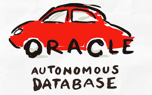
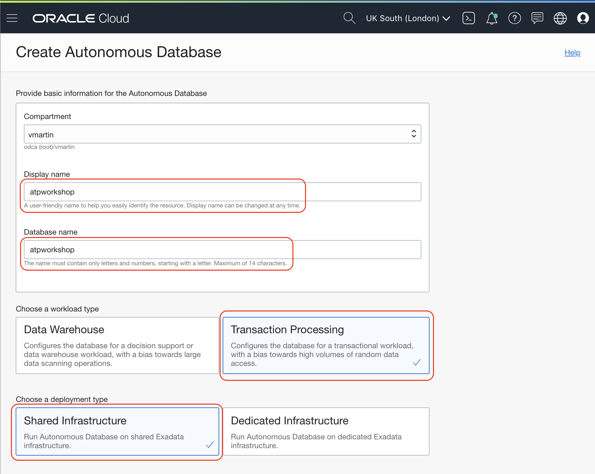
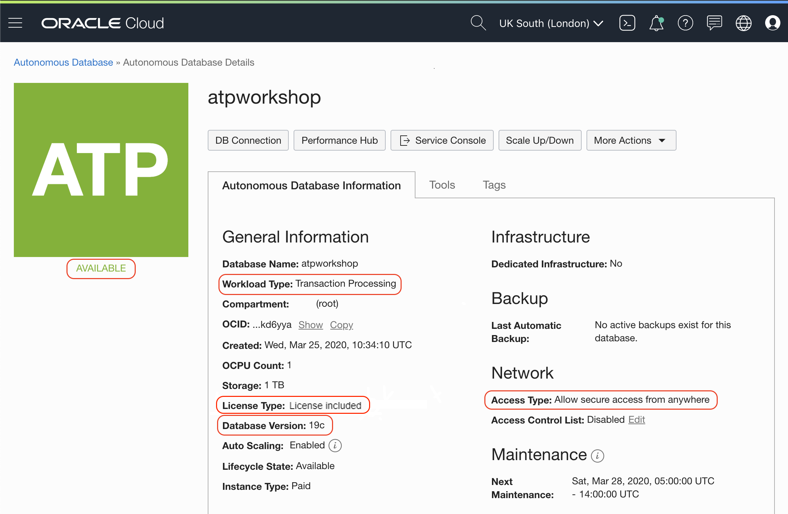
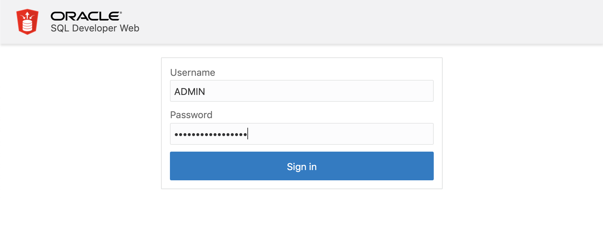
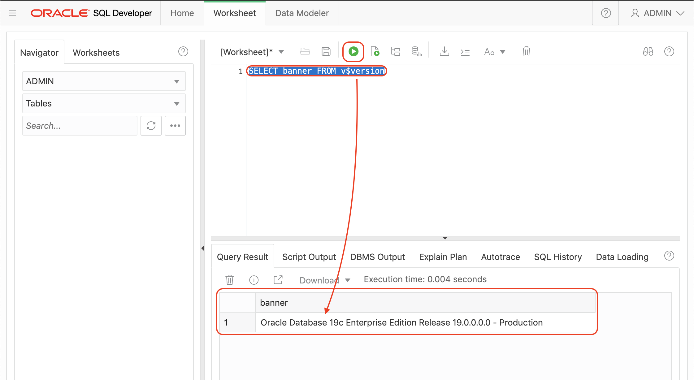

# Lab 1: Create Autonomous Database



This lab walks you through the steps to get started using the Oracle Autonomous Transaction Processing Database on Oracle Cloud Infrastructure (OCI). You will provision a new database in just few minutes.

## Create a new Autonomous Transaction Processing

Go to the Autonomous Transaction Processing (ATP) menu:


Check if you are in the **root compartment** that is fine for testing.

> Compartments are a logical separation of resources to attach roles and permissions. It will make possible to create your team structure in compartments so you know who manage what resources. Not necessary at this stage.

And click in **Create Autonomous Database** button.


You can leave the compartment as it is. It would say something like _<tenancy_name> (root)_. Write the Display name and Database name.

Make sure you select **Transaction Processing** and **Shared Infrastructure**.



You can select **Always Free** configuration to start enjoying your Free Autonomous Database.

CPU and Storage are good with default values, the same for the database version.

Auto scaling you can leave it off but it is a nice feature as the ATP database will scale if the workload is increasing and scale down automatically if the workload reduces. Zero downtime during the process. It's cool, isn't it?

Under the Create Adminisitratior credentials section, provide the **Administrator Password**. Enter any password you wish to use following the specific requirements imposed by ATP.

> Reminder: Note your password in a safe location as this cannot be reset.


Leave **Allow Secure Access From Everywhere** for the workshop and **Bring your Own License (BYOL)**. You will upload your license later when needed.

Click **Create Autonomous Database** button.


After few seconds you will have your new Autonomous Database up and running.

Look around the details and get familiar with the buttons and tabs on this page.



## Use Web SQL Developer

Time to run some SQL code. Traditionally you would have to download the software and configure the connection with the database. With Oracle Cloud and Autonomous Database you have another option available and no configuration is needed.

SQL Developer is available on the web console. Click on **Service Console** button.


It will open another browser tab with all the service console tools. You will see some metrics. For the moment, click on **Development** menu on the left.


Click on **SQL Developer Web** tile


A new browser tab will open to log-in on SQL Developer Web. The **Username** is **ADMIN** and the **Password** is the one during creation time (not the one for the Wallet zip file).



## It works

You just created an Autonomous Database with the latest features of Oracle Databases.

Finally, you run SQL Developer Web to run queries without installing or configuring anything.

Run the following SQL query:

```sql
SELECT banner FROM v$version;
```



Congratulations, you are ready for the next Lab!

---

[home](../README.md) | [**Go to Lab 2 >>>>>**](../lab2apex/README.md)
