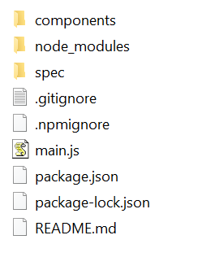

# Lab 4: Implement Custom Component

Oracle Digital Assistant allows you to build integrations with backend services by creating Custom Components.

Custom Components are a bridge between Skills on Oracle Digital Assistant and the services where information can be fetched.


Custom components allow you as well to plug-in custom code logic into a bot conversation.

That is exactly what we are going to build.

Custom Components are developed using Node.js. They are just a REST API that offer an endpoint to Skills bots to `GET` and `POST` actions.


You can package related custom components together.

## Create a Custom Component to integrate with backend services

Oracle provides Oracle Bots Node.js SDK, a free utility that makes custom components development very easy.

### Before you start

We are going to install Node.js, if you have done this you can move ahead.

[Download Node.js LTS](https://nodejs.org/en/) from the official website. It is fine if the version is higher than the one in the screenshot.


We are going to install on Windows but it works in a similar way in Linux and MacOS.


You can go with the default setup for the installation.

Final step, click **Install**:


Installation completed


The last step sometimes take a while on Windows because the lack of libraries, plus sometimes perform a Windows Update. Another reminder to swap to Linux ;) Be patient and carry on.


Check the installation when well. Open a Command Prompt, or Terminal in Linux and MacOS and run the following commands:

```bash
node -v
```

```bash
npm -v
```

```bash
npx @oracle/bots-node-sdk -v
```

Like this:


Ready to create your Custom Component scaffolding:

On the same terminal type:

```bash
npx @oracle/bots-node-sdk init natter --component-name jokes
```

Where `natter` is the name of the custom component module. And `jokes` is the name of our first custom component implementation.

The result should look like this:

```bash
---------------------------------------------------------------------
Custom Component package 'natter' created successfully!
---------------------------------------------------------------------

Usage:

  cd natter
  npm start    Start a dev server with the component package
```

> NOTE:
>
> A new folder `natter` was created with this hierarchy inside:
>
> 
>
> Note you have a `package.json` file and a `components` folder with a file `jokes.js` inside.
>

Change directory to `natter` on the Command Prompt or Terminal:

```bash
cd natter
```

This custom component is going to make REST API calls to fetch information from SODA. To do so, we need to install an extra library called [request](https://www.npmjs.com/package/request).

Install the library with the following command:

```bash
npm install request
```

Edit the file `package.json` in `natter` folder. You can use your favorite text editor. My choice is [Visual Code](https://code.visualstudio.com/) but feel free to use any. Even Notepad for those Windows user that don't want to install anything else.


We have to change the name of the package from the generic `my-custom-component` to something more personalized like `natter`. Check line number 2:


Great, we are now ready to change the code of our custom component implementation:

Edit the file `jokes.js` and replace the whole content with the following code:

```javascript
"use strict";

const request = require("request");

const ordsURL = "<SODA_URL>/ords";
const collection = "jokes";

const username = "ADMIN";
const password = "<ADMIN_PASSOWRD>";
const authString = `${username}:${password}`;

function getJokes(urlRequest, logger, callback) {
  logger.info(urlRequest);
  try {
    request(urlRequest, { json: true }, (err, res, body) => {
      if (err) {
        logger.error(err.message);
        callback(err.message);
        return;
      }
      if (res.statusCode !== 200) {
        logger.error(`Invalid status ${res.statusCode}`);
        callback(`Invalid status ${res.statusCode}`);
        return;
      }
      callback(null, body.items);
    });
  } catch (error) {
    logger.error(err.message);
    callback(error);
  }
}

module.exports = {
  metadata: () => ({
    name: "com.example.jokes",
    supportedActions: ["success", "failure"],
  }),
  invoke: (conversation, done) => {
    const urlRequest = `https://${authString}@${ordsURL}/${username.toLowerCase()}/soda/latest/${collection}`;
    getJokes(urlRequest, conversation.logger(), (err, items) => {
      if (err) {
        conversation.transition("failure");
        done();
        return;
      }
      const values = items.map((item) => item.value);
      const jokes = values.map((v) => v.text);
      conversation
        .reply("Greetings hooman! ")
        .reply(jokes.join("\n"))
        .transition("success");
      done();
    });
  },
};

```

IMPORTANT:

Remember to change the `<SODA_URL>` and `<ADMIN_PASSOWRD>` for the values as we have done in lab 2.

## Deploy the custom component

Custom Components can be deployed in different ways:

- Local Component Container: single instance deployment as custom component resides in skill bot
- Mobile Hub: multi-channel environment with mobile extras and shared instance deployment.
- Node Container: shared instance but no need for mobile extras.

We are going to install our custom component locally as a component container. Very simple, we need to pack our code in a single file that contains everything:

Package your Custom Component by running on your Command Prompt or Terminal:

```bash
npm pack
```

The output looks like this:


## It works

There will be a new file in your `natter` folder called `natter-1.0.0.tgz`.


Congratulations! You are ready to go to the next Lab!

---

[**<< Prev**](../lab3/README.md) | [home](../README.md) | [**NEXT >>>>>**](../lab5/README.md)
