# Lab 5: Create Digital Assistant Skill

Digital assistants consist of one or more skills, which are individual chat bots that are focused on specific types of tasks.

You will create a skill that can be used for interactions with a backend service, using the Custom Component you built on previous lab.

As part of this process, you will:

- Create a new skill
- Import your Custom Component (the `tgz` file you generated with `npm pack`)
- Create two intents: `Greeting` and `ListTasks`

## Build your first Skill

In this lab, we're starting from scratch. So the first thing you'll do is create a new skill.

Click on `+ New Skill` button to start:


Fill the information like in the image and click `Create` button:

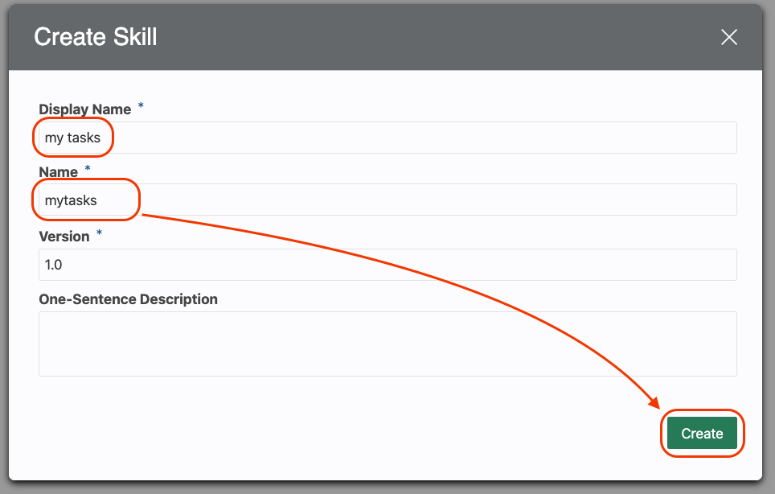

---

## Import the Custom Component

Import Custom Component is very simple.

Go to the Components view  on the left menu.


The web form to upload the file will show up.

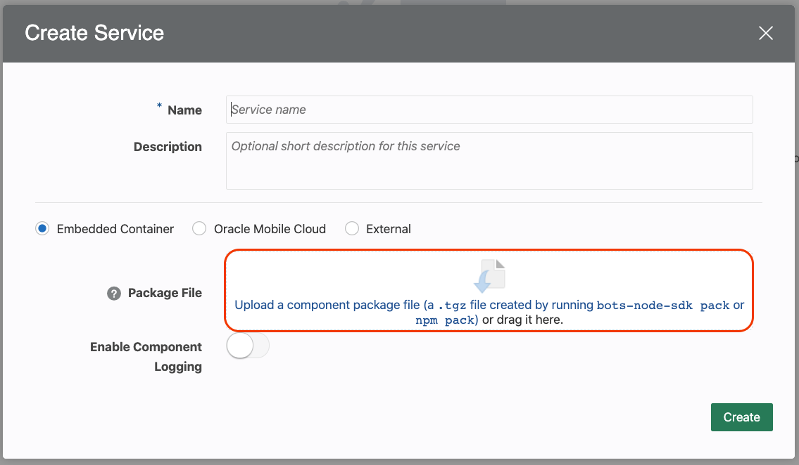

Upload `tasks-cc-1.0.0.tgz` file.


Fill the information and remember to `Enable Component Logging` with the toggle button.


Wait for the deployment.


Make sure the `Status` is `Ready` and you see all the information like in this screenshot.


---

## Create intents

Oracle Digital Assistant's underlying natural language processing (NLP) engine doesn't inherently know about the business or task that a skill is supposed to assist with. For the skill to understand what it should react to, you need to define intents and examples (utterances) for how a user would request a specific intent.

Create Greeting intent, click `+ Intent`:


Modify default values.


For `Greeting` intent.


Click on `+ Intent` on the same screen.

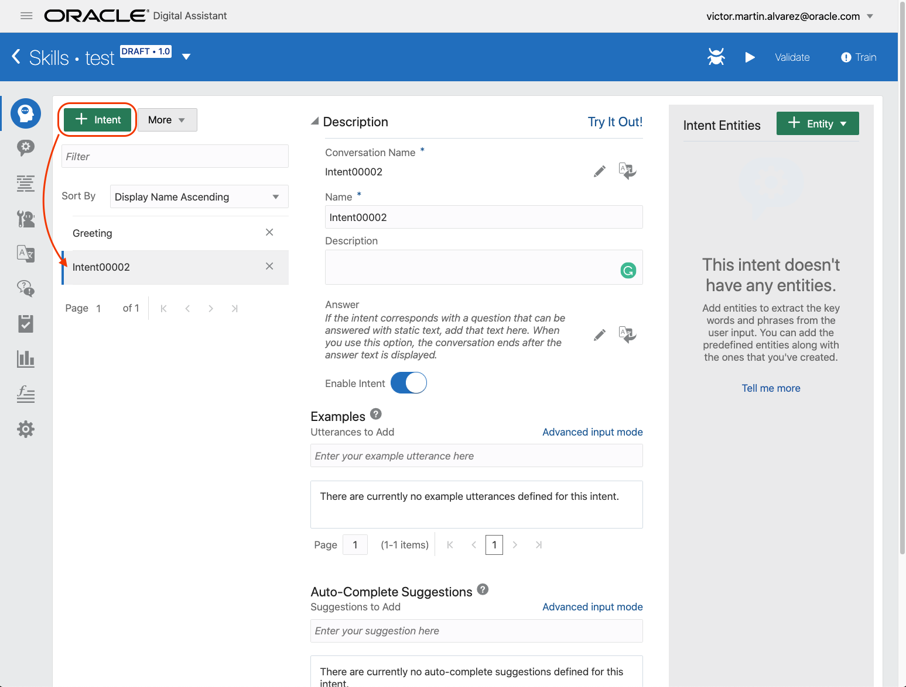

Modify default values for `ListTasks` intent.

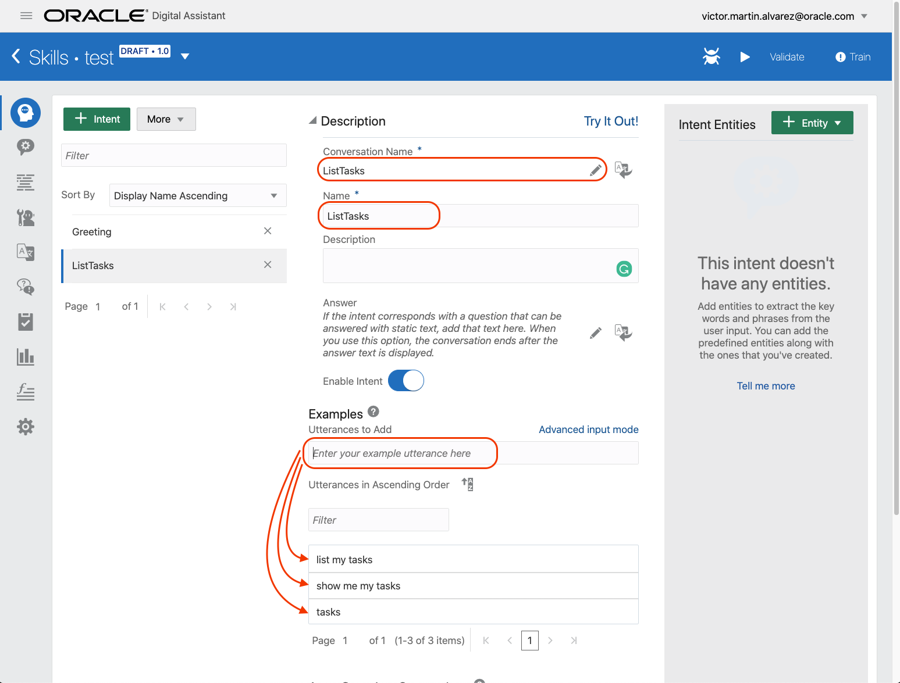

## Put everything together

Time to integrate your Custom Component with the Intent `ListTasks` created before.

On the left menu, you will find the Flows entry with this icon:


You will see the `YAML` file that define the behaviour of your Skill.


Delete the initial content.


Replace it with:

```yaml
metadata:
  platformVersion: "1.1"
main: true
name: mytasks

context:
  variables:
    iResult: "nlpresult"

states:
  intent:
    component: "System.Intent"
    properties:
      variable: iResult
    transitions:
      actions:
        Greeting: greeting
        ListTasks: listTasks
        unresolvedIntent: unresolved

  greeting:
    component: System.Output
    properties:
      translate: false
      text: "Greetings, hooman!"
      keepTurn: false
    transitions:
      return: greeting

  listTasks:
    component: com.example.tasks
    transitions:
      actions:
        success: successState
        failure: failureState

  successState:
    component: "System.Output"
    properties:
      text: |-
        Success!
      keepTurn: false
    transitions:
      return: "done"

  failureState:
    component: "System.Output"
    properties:
      text: |-
        Failed! Check the logs.
      keepTurn: false
    transitions:
      return: "done"

  unresolved:
    component: System.Output
    properties:
      translate: false
      text: "I don't understand. What do you want to do?"
      keepTurn: false
    transitions:
      return: unresolved
```

**XXX** Explain every part of the Flows definition.

It should look like:

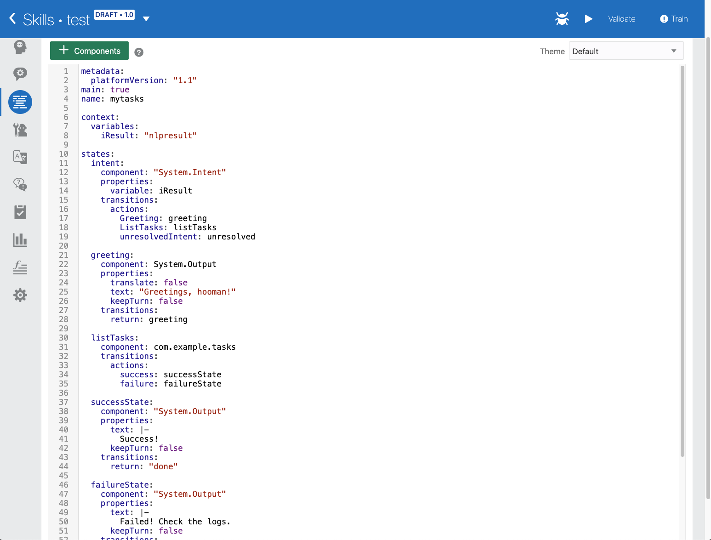

Make sure all the syntaxis is correct on the flow by clicking `Validate` button.


Click `Train` button to run the machine learning algorithm.

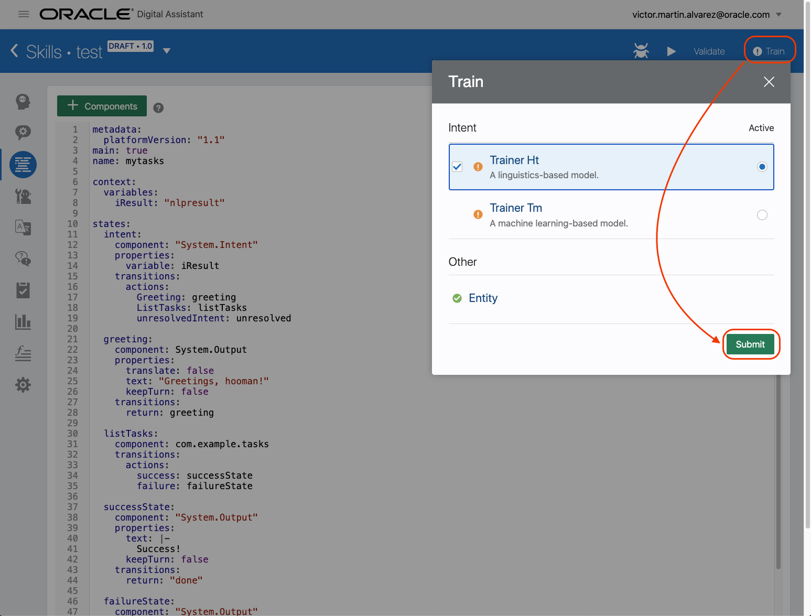

Wait for the confirmation.

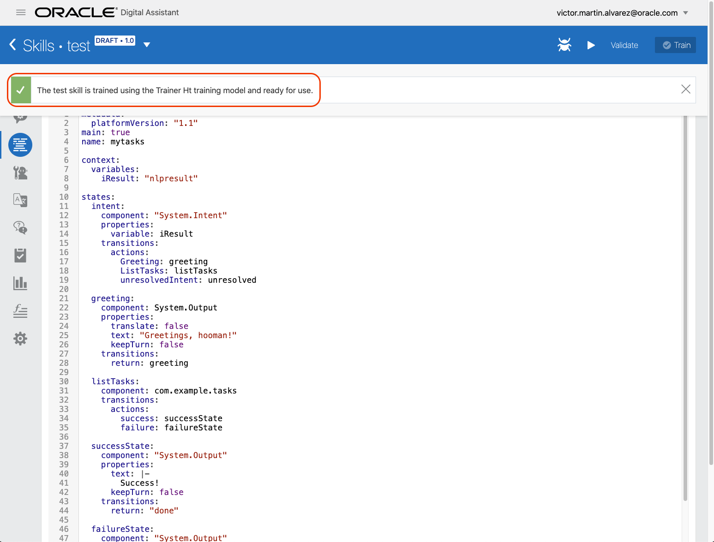

Run the test of the skill:

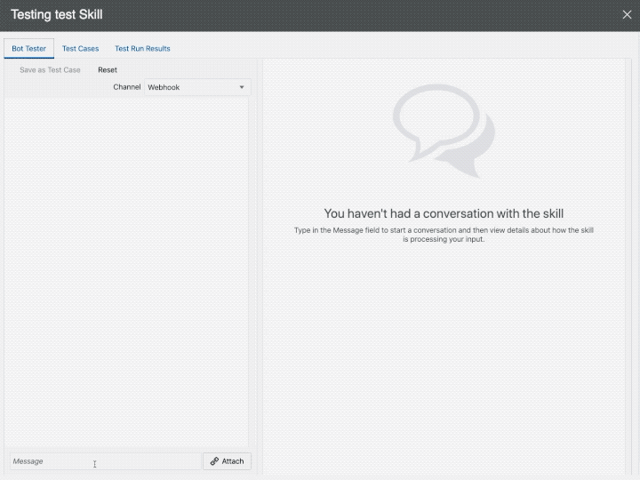

> NOTE:
>
> If you see an error message at this point, it means there is a problem with the custom component code.
>
> To get more information about the issue, check the logs.
>
> Go to Components  on the left menu and click on Diagnostics for your Custom Component, then on **View Logs**.
>
> 

## It works

To see how we request against the database we can add a new item:

Insert your third element in the collection by going to APEX and on the Top Menu on **SQL Workshop**, click **Object Browser**:


Select **TASKS** table on the left and click the tab **Data**, then click **Insert Row**:


Add a new **Text** like `New item!` and click **Create**:

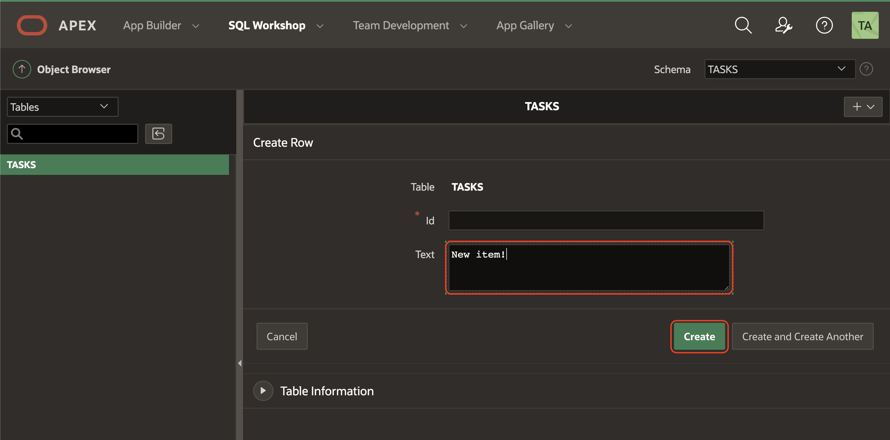

confirm the row has been created:


Run the chat again and reset the previous conversation.

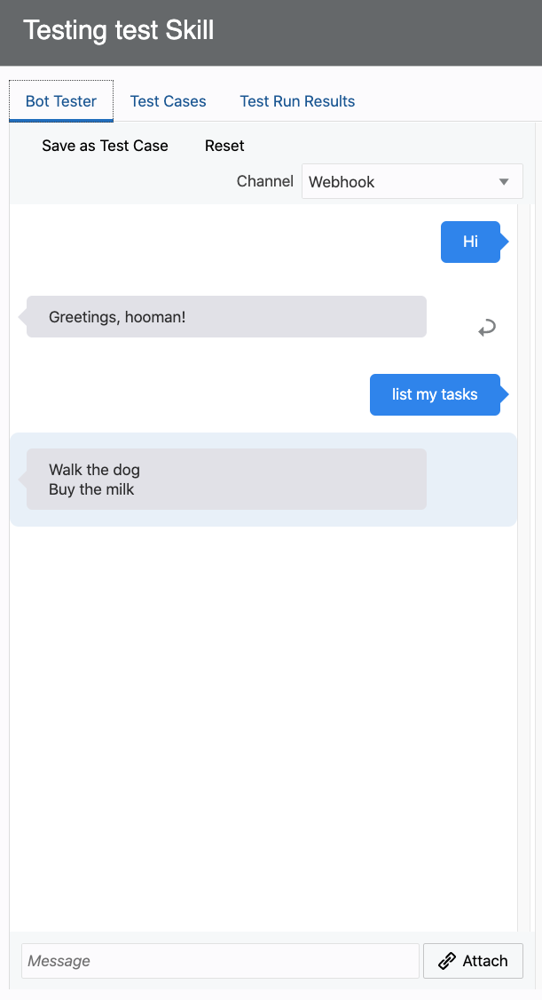

Type `show me my tasks`:

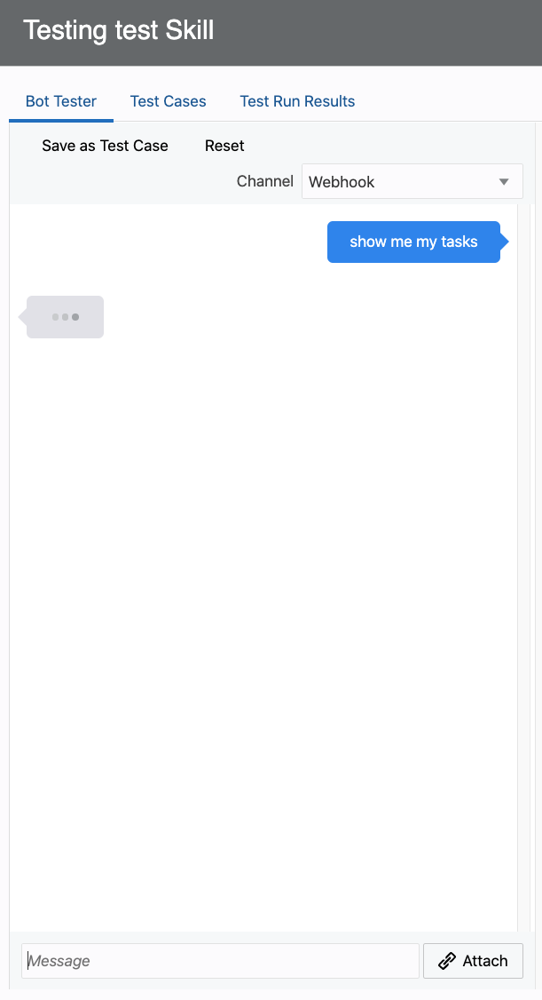

Check the result.

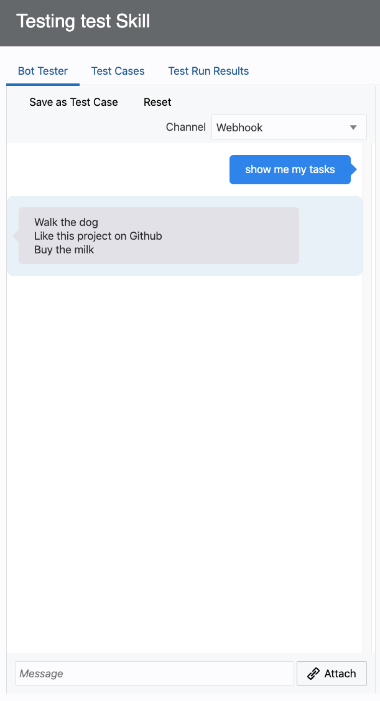

# Congratulations! Well done!

Continue to the Appendix for more information!

---

[**<< Go to Lab 4**](../lab4/README.md) | [home](../README.md) | [**Go to APPENDIX >>>>>**](../appendix/README.md)
